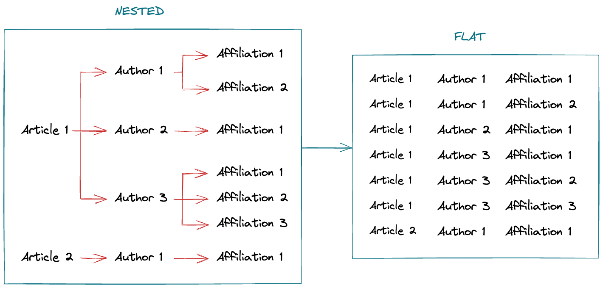
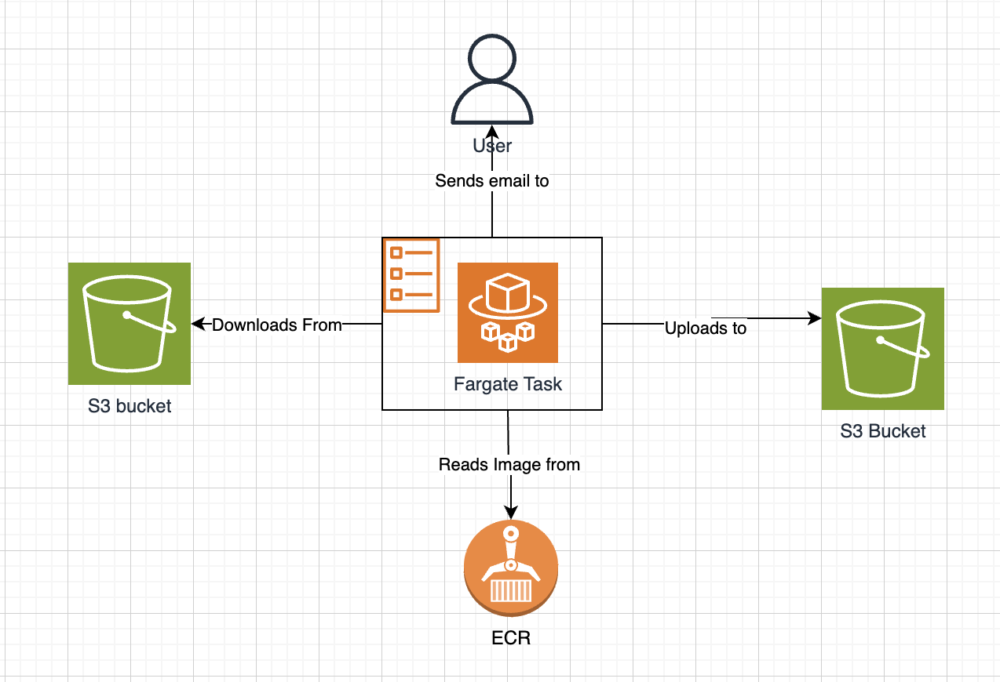

# Public Medical Articles Data Pipeline

## A ETL pipeline that extracts Public Medical Articles and Matches Institute names using NLP and Data Matching
In this project, I will extract an XML file of large number of Public Medical Articles and aim to convert the data into a flat csv format.

Data format from XML to csv:

In the process of transforming the data, I will create a consistent naming format for within the article, as currently the XML can have names of institution that refer to the same institute but are different as strings e.g. 'Harvard University' and 'Harvard Medical School'.
This inconsistency in names can have an negative impact on data analysis so we aim to solve this problem in this case study.
We will do this with a subsection of ML called NLP to automate this process.

The project's main goal is to match the names of the institutions in the PubMed dataset to the 'source of truth' in the GRID datasets.

## Pipeline
For this project the pipeline is simple as the main focus is on optimising the data matching. Here is the Architecture Diagram that includes the AWS Services used.

## Files Explained

- `README.md`
  - This is the file you are currently reading
- `.gitignore`
  - This file is used to tell Git what files to ignore for any changes. This can be safely ignored.

- github/workflows
  - github actions main.yaml

- `pipeline` folder
  - python ETL pipeline
  - Sample data file
  - Dockerfile
  - Analysis Jupyter Notebook
